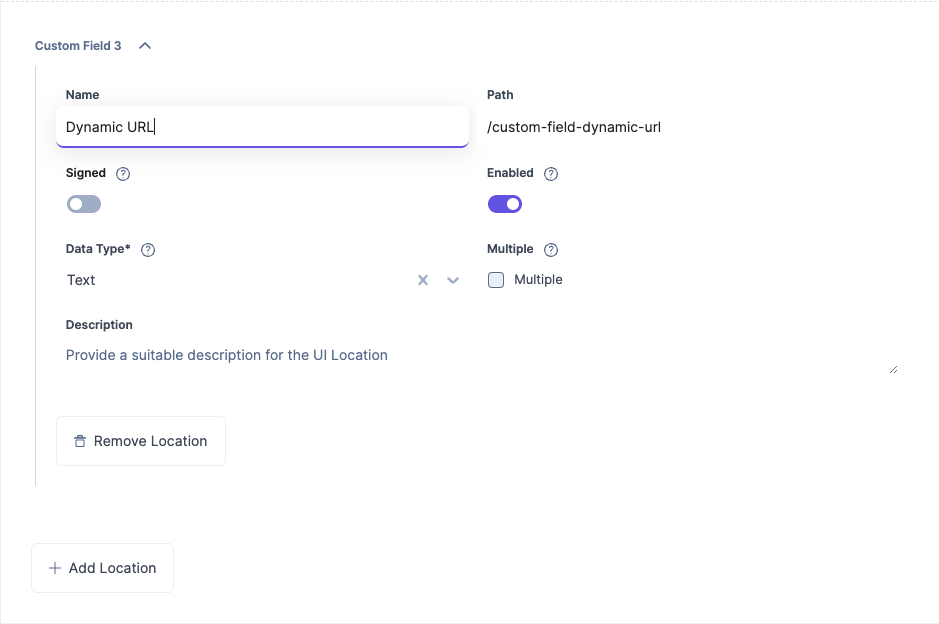
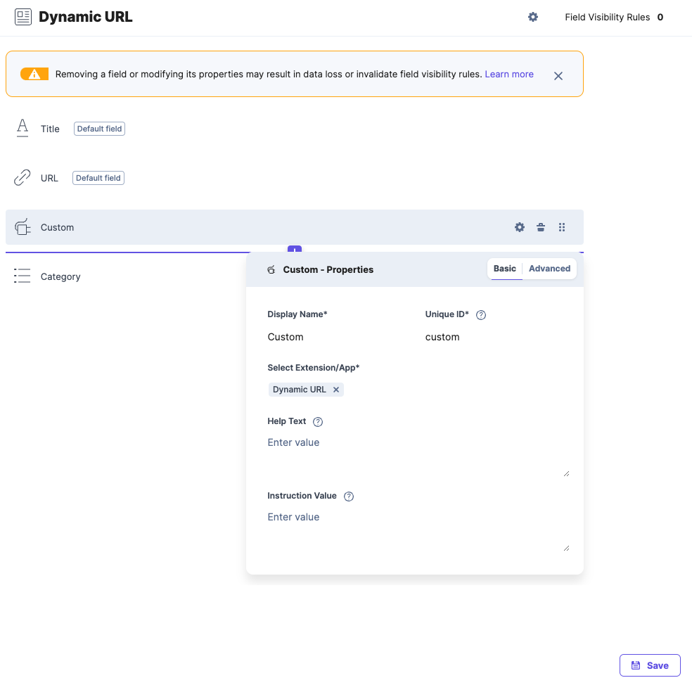

#  Contentstack Marketplace App Boilerplate

  This project assumes you have a project set up in the Developer Hub already.

##  Dynamic URL

To use the Dynamic URL custom field follow the below steps. 
1. Create a custom field app location
   

2. Create the custom field route based on the pathing inside your application. This example uses `/custom-field-dynamic-url` and the type is `Text`

3. Go to your content model and create a custom field and select the custom field you just created

The app is hardcoded and uses the following has to be followed:
1. This field only works after an entry has been ***saved**
5. Category (category) field that prepends to the title
6. Title (title) a default field in Contentstack
7.  URL (url) a default field in Contentstakc

##  References

- [Marketplace App Boilerplate](https://www.contentstack.com/docs/developers/developer-hub/marketplace-app-boilerplate/)
- [Marketplace Boiler Plate](https://github.com/contentstack/marketplace-app-boilerplate)